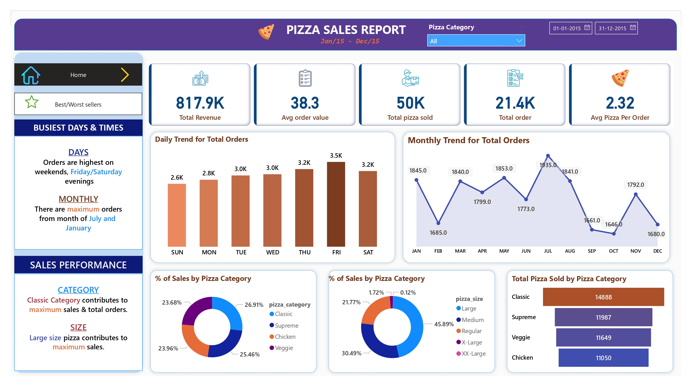
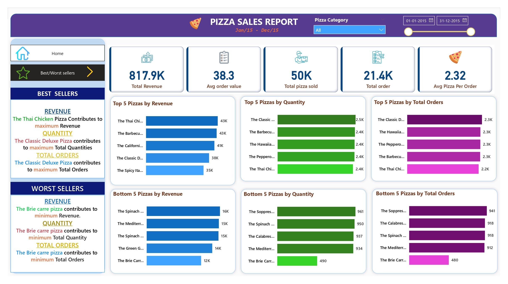

# 🍕 Pizza Sales Analysis Dashboard (SQL • Excel • Power BI)

## 📌 Problem Statement  
The goal of this project is to analyze pizza sales data to understand business performance and customer buying patterns.  
By calculating key KPIs and building interactive charts, we aim to identify trends, best-selling products, and areas of improvement.

---

## 📊 KPI Requirements  
We calculated the following key performance indicators (KPIs):

- **Total Revenue**  
  → Sum of the total price of all pizza orders  

- **Average Order Value (AOV)**  
  → Total Revenue ÷ Total Orders  

- **Total Pizzas Sold**  
  → Sum of quantities of all pizzas sold  

- **Total Orders**  
  → Count of unique orders  

- **Average Pizzas per Order**  
  → Total Pizzas Sold ÷ Total Orders  

---

## 📈 Charts & Visualization Requirements  

The following charts were created to understand sales trends and product performance:

- **Hourly Trend for Total Pizzas Sold**  
  → Stacked bar chart showing hourly order volume to identify peak hours  

- **Weekly Trend for Total Orders**  
  → Line chart to observe weekly sales patterns and peak weeks  

- **Percentage of Sales by Pizza Category**  
  → Pie chart showing contribution of each category to total sales  

- **Percentage of Sales by Pizza Size**  
  → Pie chart to understand customer preference by size  

- **Total Pizzas Sold by Pizza Category**  
  → Funnel chart comparing total pizzas sold across categories  

- **Top 5 Best Sellers (by Revenue, Quantity, Orders)**  
  → Bar chart showing top-performing pizzas  

- **Bottom 5 Worst Sellers (by Revenue, Quantity, Orders)**  
  → Bar chart highlighting underperforming pizzas  

---

## 🛠️ Tools & Technologies Used  

- **Excel** – Initial data cleaning and formatting  
- **MySQL** – Data cleaning, transformation, and KPI analysis  
- **Power BI** – Dashboard creation and data visualization  

---

## 🎯 Key Learnings

- Handling real-world dirty data (date format issues, data types)  
- Writing analytical SQL queries  
- Building KPI metrics for business analysis  
- Creating interactive dashboards in Power BI  
- Extracting meaningful insights from raw sales data
  --
  ## 📸 Dashboard Preview
- Home Page

- Best/Worst Seller Page

---
## 👤 About Me

**Shubham Pandey**  
Aspiring Data Analyst | Power BI | SQL | Python  

- Strong interest in HR Analytics and Business Intelligence  
- Actively building real-world analytics projects  

📫 Feel free to connect with me on LinkedIn and review my other projects.
- LinkedIn Link- www.linkedin.com/in/itzshubhampandey

